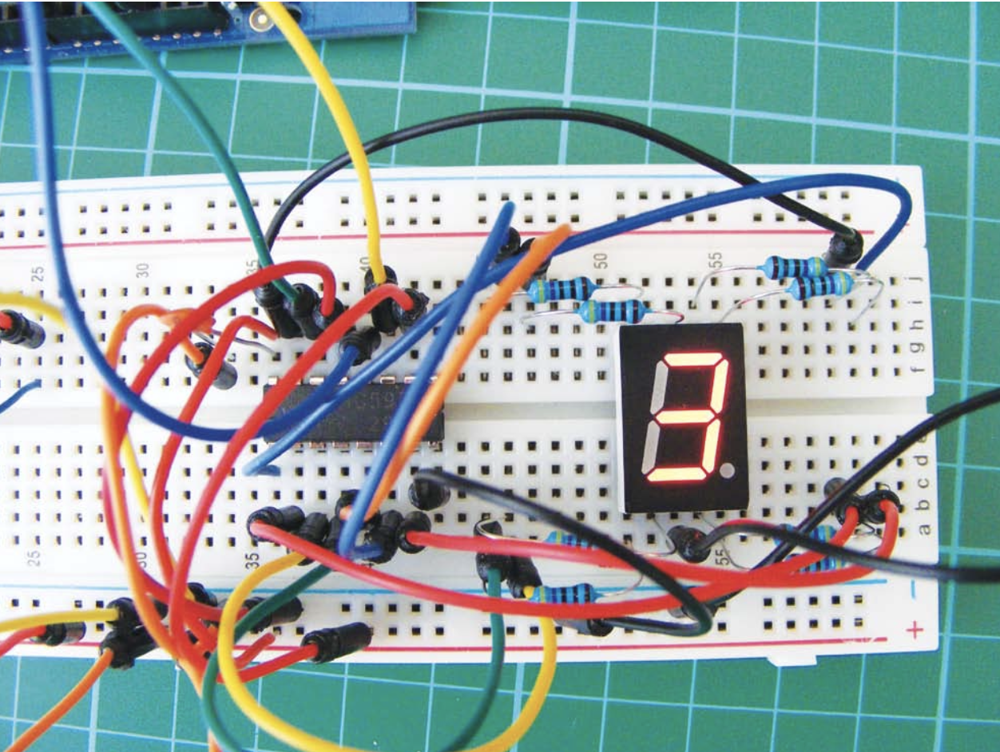

# Arduino Electronic Die

## Introduction

The **Arduino Electronic Die** is a project that simulates a rolling die using an Arduino Uno R3 and a 7-segment display. It includes two different implementations:

1. **Arduino Sketch (.ino file):** A simple version using the Arduino IDE.
2. **Pure Embedded C Version:** A modular implementation using pure embedded C, compiled with `avr-gcc` and programmed using `avrdude`.

Both versions provide the same functionality but demonstrate different programming methods for microcontrollers.

## Project Structure

```
.
├── LICENSE
├── Makefile
├── README.md
├── include
│   ├── application
│   │   └── dice.h
│   └── drivers
│       ├── adc.h
│       ├── button.h
│       ├── delay.h
│       ├── display.h
│       ├── gpio.h
│       ├── random.h
│       └── shift_register.h
├── ino
│   └── DiceRoller
│       └── DiceRoller.ino
├── setup1.png
├── setup2.png
└── src
    ├── application
    │   ├── dice.c
    │   └── main.c
    └── drivers
        ├── adc.c
        ├── button.c
        ├── delay.c
        ├── display.c
        ├── gpio.c
        ├── random.c
        └── shift_register.c
```

## Hardware Setup

The project requires the following components:

- **Arduino Uno R3**
- **Breadboard**
- **Jumper Wires**
- **8 220-ohm Resistors**
- **Seven-segment LED Display**
- **74HC595 Shift Register**
- **Momentary Tactile Four-pin Pushbutton**

Refer to the wiring diagrams and hardware setup images below. Ensure all connections are correct to avoid damage.





## Software Implementation

### Arduino Sketch Version

The Arduino sketch version is located in the `ino/DiceRoller` directory.

- **File:** `DiceRoller.ino` – Implements the die functionality using the Arduino IDE.

To use this version:

1. Open `DiceRoller.ino` in the Arduino IDE.
2. Connect the Arduino Uno R3 to your computer.
3. Select the correct board and port in the IDE.
4. Upload the sketch.

### Pure Embedded C Version

This version uses a modular approach with separate headers and source files.

- **Source Files:** Located in `src/`
  - `application/`: Application-level code with `main.c` (entry point) and `dice.c` (dice logic).
  - `drivers/`: Hardware abstraction, including control for ADC, buttons, delays, and the shift register.
- **Headers:** Located in `include/`
- **Build Outputs:** Compiled binaries (`.hex` and `.elf`) are placed in `bin/` after building.
- **Makefile:** Controls the build process and microcontroller programming.

### Compilation and Upload Instructions

**Prerequisites:**

- Install `avr-gcc`, `avr-libc`, and `avrdude`.
- Ensure you have access permissions for the serial port.

**Steps to Compile and Upload:**

1. **Open Terminal and Navigate to Project Directory**
2. **Clean Previous Builds (Optional):**
   ```
   make clean
   ```
3. **Compile the Code:**
   ```
   make
   ```
   This generates the `dice_roller.hex` file in the `bin/` directory.
4. **Upload to Arduino Uno R3:**
   ```
   make upload
   ```
   Update the `PORT` variable in the Makefile to match your Arduino's serial port.
   ```Makefile
   PORT = /dev/cu.usbserial-110  # Update to your serial port
   ```

## How It Works

1. **Button Press Detection:** Continuously checks if the button is pressed.
2. **Dice Rolling Animation:** The 7-segment display shows an animation to simulate a rolling die.
3. **Displaying Result:** After the animation, a random number between 1 and 6 is displayed.

Randomness is achieved using ADC readings as a seed for generating random numbers.

## License

This project is licensed under the MIT License. See the `LICENSE` file for more information.

## Contact

For any questions or suggestions, please reach out to the author, **Ameed Othman**.


